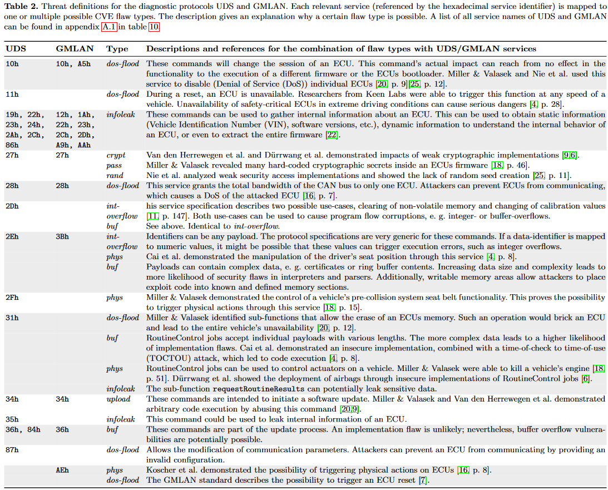

# fivedollarwrench
The $5 wrench solution to heavy trucks CAN hacking


A resource for tips, tutorials, and resources for hacking CAN and SAE J1939. It's not the most elegant or sophisticated set of tools. But it will get the job done.

# CAN Tools

## Tool: SocketCAN

### Getting the USB2CAN-FD 2x up
```
sudo ip link set can0 down
sudo ip link set can0 up type can bitrate 500000 dbitrate 2000000 fd on
sudo ip link set can1 down
sudo ip link set can1 up type can bitrate 500000 dbitrate 2000000 fd on
```

### Bringup for USB2Can
```
sudo ip link set can0 down
sudo ip link set can0 up type can bitrate 500000
```

### Send Tester Presents
#### Example Command

```bash
cangen can0 -I 18DA00F9 -D 023E00 -L 8 -e -g 3000
```

#### Explanation:
- **`can0`**: The CAN interface (replace with your actual interface name).
- **`-I 18DA00F9`**: Sets the arbitration ID to `0x18DA00F9` (ID for diagnostics).
- **`-D 18DAF900`**: Sets the data field to `0x3E00` (Tester Present with positive response).
- **`-L 8`**: Sets the data length to 8 bytes.
- **`-e`**: Allows extended ID frames. 
- **`-g 3000`**: Sets the gap between messages to 3000 milliseconds (3 seconds).

#### Command to Suppress Positive Response

If you want to suppress the positive response, you can use `0x3E80` instead:

```bash
cangen can0 -I 18DA00F9 -D 023E80 -L 8 -e -g 3000
```


## Tool: PythonCAN
* [Official Docs](https://python-can.readthedocs.io/en/stable/)
* [Python CAN Tutorial](./pythoncan.md)

## Tool: Caring Caribou

**Link:**
https://github.com/CaringCaribou/caringcaribou

Using Caring Caribou to discover UDS devices on the CAN network.
```
caringcaribou -i <INTERFACE> uds discovery -min 0x18daf100 -max 0x18daf1ff

# INTERFACE could be something like vcan0 or can0, etc.
```

To do an automated UDS discovery you can try something like
```
caringcaribou -i <INTERFACE> uds auto -min 0x18daf100 -max 0x18daf1ff
```

Getting UDS seeds
```
caringcaribou uds security_seed 0x03 0x01 0x18da00f1 0x18daf100 -d 0.5 -r1
```

Full docs:
https://github.com/CaringCaribou/caringcaribou/blob/master/documentation/uds.md


## Tool: CANCat

## Tool: Scapy

* [Video: Automotive Pentesting with Scapy](https://www.youtube.com/watch?v=7D7uNqPWrXw)

## Tool: TruckDevil
[Truck Devil Tutorial](./truckdevil.md)

## Tool: SavvyCAN

# Diagnostics - Unified Diagnostic Services (UDS)

[Automated Threat Evaluation of Autmotive Diagnostic Protocols](https://opus4.kobv.de/opus4-oth-regensburg/frontdoor/deliver/index/docId/2988/file/ESCARPaper.pdf) 
contains a nice table mapping threats to UDS services.




# Additional Resources
* [Awesome CANbus](https://github.com/iDoka/awesome-canbus)

# Research
* [Automated Threat Evaluation of Automotive Diagnostic Protocols](https://www.researchgate.net/publication/351483528_Automated_Threat_Evaluation_of_Automotive_Diagnostic_Protocols) 


# Reverse Engineering

* [RE Tooling](https://github.com/wtsxDev/reverse-engineering)
* [Godbolt](https://godbolt.org/) - Compare compilers output online
* [Dogbolt](https://dogbolt.org/) - Compare decompilers online
